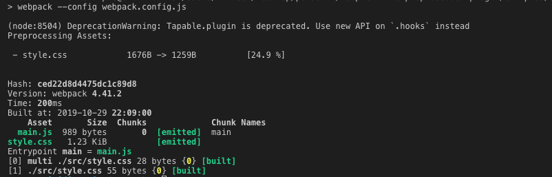

# CSS Minifier Example

A simple example of minifying css files before they're emitted using this plugin.

## Trying out

Install dependencies.

```
$ yarn
```

Run build.

```
$ yarn build
```



## Configuration

Check the webpack configuration [here](webpack.config.js).
